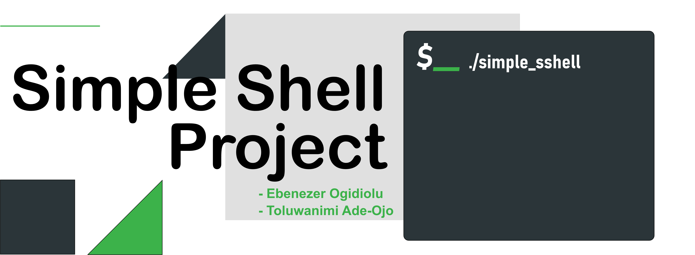

# Simple Shell Project
 This is a simple shell built in C language with basic functionality.

## Motivation
This project is made for learning purposes and because ***#CisFun***.

It is part of the **Programming foundations** at ALX Software Engineering School

## Authors
Ebenezer Ogidiolu - Software Developer - [@dsoft02](https://www.linkedin.com/in/ogidioluebenezer/)

> :rocket: Let's follow each other on [Github](https://github.com/dsoft02)

Toluwanimi Ade-Ojo - Software Developer - [@ManLikeTeetos](https://www.linkedin.com/in/ade-ojo-toluwanimi/)

> :rocket: Let's connect! [Github](https://github.com/ManLikeTeetos)

